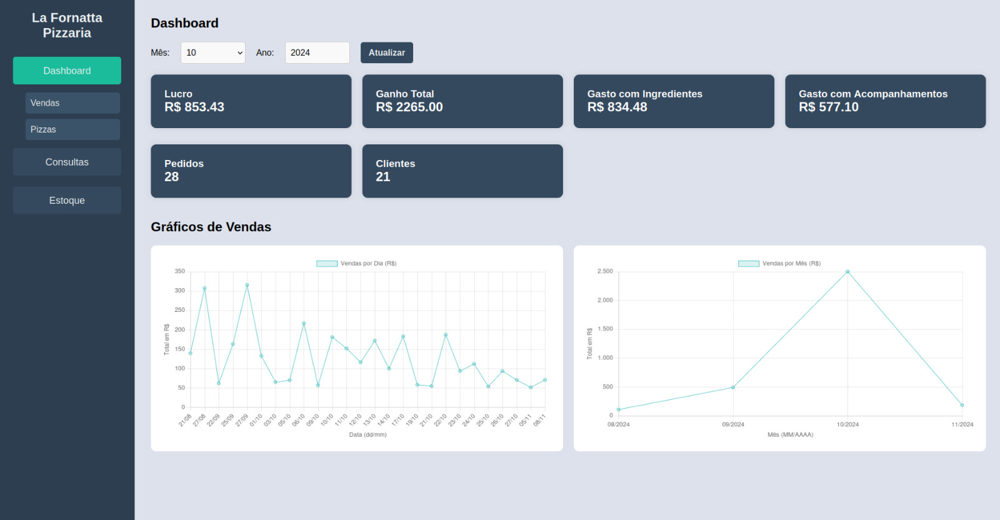
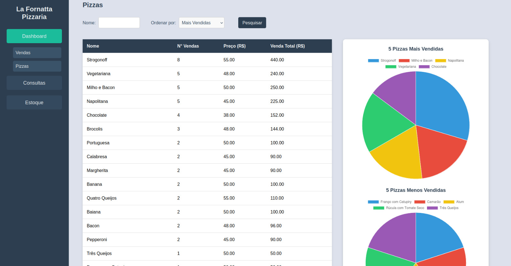

# Projeto de BD com Interface WEB
Neste projeto, desenvolvi uma interface WEB que gera dashboards (gráficos e tabelas) e permite realizar consultas no banco de dados. Para desenvolver a interface WEB, foram utilizados no frontend: HTML, CSS e JavaScript. Já no backend foram utilizados: Python e Flask. Para criar o banco de dados foi utilizado o PostgreSQL.




## Requisitos
- **Python**: 3.12.7
- **PostgreSQL**: 16.6


**Observação:** No Windows, pode ser necessário instalar o **Microsoft C++ Build Tools**, pois o Python depende de suporte para compilar alguns componentes em C.

### Opcional:
Para rodar o frontend (interface web) utilizamos o **Visual Studio Code** com a seguinte extensão: **Live Server (Ritwick Dey)**.

## Etapas para rodar o projeto

### SQL

**1. Criar o Banco de Dados** 

- Acesse o "**pgAdmin 4**" (ou outra interface gráfica do PostgreSQL) e crie um novo banco de dados;

- Clique com o botão direito sobre o banco de dados e clique em "**Query Tool**";

- Abra o arquivo "**script.sql**" localizado no diretório "**Código_SQL**" do projeto e execute as linhas do script na "**Query Tool**" do "**pgAdmin 4**".

**2. Editar o arquivo de conexão do backend com o banco de dados** 

No arquivo de conexão do banco de dados com o backend (**conector.py**) é necessário alterar o `user`, `password` e `dbname` para as credenciais do seu **PostgreSQL** e o nome que você escolheu quando criou o banco de dados.

O arquivo está no seguinte local: `Projeto_BD1/Interface/backend/servicos/database/conector.py`

### Backend
**Observação:** No Windows, utilize o **Prompt de Comando (cmd)** em vez do **PowerShell**. No PowerShell, configurações adicionais são necessárias para executar o ambiente virtual do Python, no cmd isso não é necessário.

**1. Abra o terminal (cmd) e acesse o diretório "backend"**

- Exemplo de comando no Windows:

```bash
cd OneDrive\Área de Trabalho\Projeto_BD1\Interface\backend
```

- Exemplo de comando no Linux:

```bash
cd Área de Trabalho/Projeto_BD1/Interface/backend
```

**2. Crie o Ambiente Virtual em python e inicie-o**

- Comandos no Windows:

```bash
python -m venv venv
.\venv\Scripts\Activate
```

- Comandos no Linux:

```bash
python3 -m venv venv
source venv/bin/activate
```

**3. Instale as dependências para o Backend**

- Execute o comando: 

```bash
pip install -r requirements.txt
```

**4. Rode o servidor backend**

- No Windows:

```bash
python main.py
```

- No Linux:

```bash
python3 main.py
```

### Frontend
**1. Instale a extensão Live Server** 

Vá na área de extensões do Visual Studio Code e instale a extensão Live Server (Ritwick Dey).

**2. Rode o Frontend**

Abra o arquivo "index.html" no VS Code que está em : `Projeto_BD1/Interface/frontend/index.html` e clique no botão "Go Live" (no canto inferior direito). Isso iniciará o servidor do frontend e abrirá a interface web no navegador.